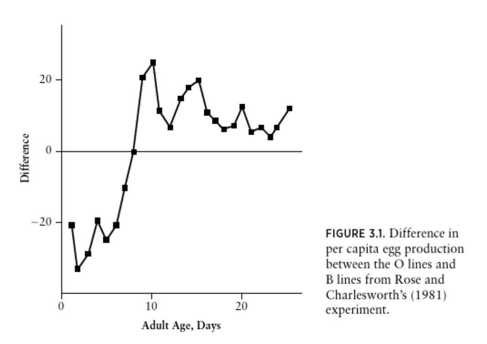

# Jan 12: **ASSIGNMENT** Rmarkdown and tidyverse 
(Dates changed owing to the university closure for a snow day)

ASSIGNMENT 1 due Jan 26.

**PART I** is to reproduce a figure and the figure caption of a plot in [Vandermeer and Goldberg 2013](https://ebookcentral-proquest-com.qe2a-proxy.mun.ca/lib/mun/detail.action?docID=1205619) or another textbook or a published paper in Rmarkdown and as an output file: .hmtl, .pdf, or .docx. Please choose a figure to reproduce in the area of Population Biology or Evolutionary Ecology.

You can simplify a complex figure if necessary. Your figure should be made in `ggplot()` and have:

- the title (if there is one),

- axes labels,

- points or lines or both,

- approximately the same data as the original figure,

- the correct axes limits.

The objective is for you to learn how to use Rmarkdown to make a synthetic write-up that includes code, a figure and text. Your completed output should have:

1. A brief text description of where I can find the figure you reproduced.
2. Code that makes a figure that is suppressed in the output file.
3. The reproduced figure (or simplified figure).
4. The actual figure

You are to hand-in the `.Rmd` file and an output file (`.html`, `.pdf`, or `.docx`)

Here, is an example of what a completed PART 1 looks like (as an .html output).

---

The graph is Figure 3.1 from [Population Ecology: First Principles - Second Edition (Vandermeer and Goldberg)](https://ebookcentral-proquest-com.qe2a-proxy.mun.ca/lib/mun/detail.action?docID=1205619) on p67.

```{r, echo=F, message = F}
require(ggplot2)
age = seq(1,25)
difference = c(-20, -26, -24, -20, -22, -20, -10, 0,
               20, 23, 9, 5, 12, 14, 16, 10, 8, 6, 7, 11, 5, 6, 4, 5, 10)
data = data.frame(age=age, difference = difference)
g1=ggplot(data = data, aes(x = age, y = difference)) + 
  geom_point() +
  geom_line() +
  xlab("Adult Age, Days")+
  ylab("Difference")
g1
```

**FIGURE 3.1** Difference in per capita egg production between the O lines and B lines from Rose and Charlesworth's (1981) experiment.

```{r, echo=FALSE, out.width = '90%'}

```

---

Instructions to complete PART I are [here](#partI).

**PART II** of this assignment is to clean up messy data. As a biologist, much of my coding work involves getting data into the right format to use in functions, this might be a plot function like `ggplot()`, which you used in PART I, or a statistical function like `lm()`, which  will perform a regression, t-test, or analysis of variance. The objective of PART II is to practice cleaning messy data into a useable format.

1. You are to clean the messy data from [here](https://datacarpentry.org/semester-biology/exercises/Tidy-data-improving-messy-data-SQL/) enough so you can make a plot using `ggplot()`. Some helpful instructions for how to do this are [here](#partII). The code that you write **must use the `select()`, `mutate()`, and `ggplot()` functions**. The graph that you make must be different than the example given in the instructions - for example, you might plot the same variables but for Plot 2.

(perhaps this sounds easy - this data is pretty messy - I found it quite hard!)

**TO HAND IN**

1. Hand in an `.Rmd` file and an output file (`.html`, `.docx`, or `.pdf`) with the solutions to both PART I and PART II of this assignment. Each part is 10 marks for a total of 20 marks.
